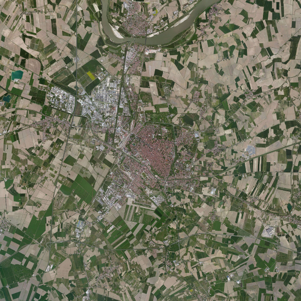

People can find a lot of free sources of satellite imagery such as [Sentinel Scientific Data Hub](https://scihub.copernicus.eu/) 
and [Sentinel-2 AWS portal](http://sentinel-pds.s3-website.eu-central-1.amazonaws.com/) of the Copernicus program
and [Landsat-8 AWS portal](https://aws.amazon.com/public-data-sets/landsat/) of NASA. However a cloud-free and global basemap 
like that of Google or Bing is not trivial to obtain. Before writing this post, I did not know that DigitalGlobe, 
partnering with Amazon, has released [SpaceNet](https://aws.amazon.com/public-data-sets/spacenet/) with very high
resolution imagery from WorldView satellites. I wish I knew this earlier but anyway SpaceNet is limited and at the time 
I write this, just the imagery of Rio De Janeiro was released.

The good thing is both APIs of Google Maps and Bing Maps allow users to download a limited amount of "patches" each month.
To me this is more than enough. The rest is to stitch patches together into a large map. 

Steps to download a satellite image of a geographical place is as follows:
1. Given a location, e.g Manchester
2. Using reverse geocoding service to get the longitude and latitute of the location
3. Determine the extent of the area, either manually or automatically wrt the given bounding box. Most of the time that 
bounding box is much larger than the area. So you may want to limit the maximum image size.
4. Given a [zoom level](), calculate a meshgrid of points whose coordinates (lat,lon) will be used to call the API. At this step,
the longitude and latitude in degrees are converted into pixel coordinates. 
5. Once all patches are retrieved, stitching them together.

Reverse geocoding is also provided by Google and Bing. I choose [Overpass API](http://wiki.openstreetmap.org/wiki/Overpass_API) to 
querry city names from [OpenStreetMap](https://www.openstreetmap.org/) and [Nominatim API](http://wiki.openstreetmap.org/wiki/Nominatim), a geocoding service based upon.
Step 4 is quite complicated for guys have no knowledge of how Earth is indexed.
The best explanation comes with the picture below
 

This article [Bing Map Tile System](https://msdn.microsoft.com/en-us/library/bb259689.aspx) from Bing explain how the Bing Map 
is shattered into tiles at every zoom level (there are 19 levels in total). There is a slight different between Bing and Google, 
in terms of coordinates as well as the basic batch size. Find out yourself.

Noticeably, each patch downloaded from Bing and Google is watermarked of course. I find Bing watermarking is more 'friendly'.
My repo scripts for this stuff is accessible at [gmapcrawler](https://github.com/vodp/mapcrawler), where a part of the 
code is borrowed from this [gmap_tiles](https://github.com/nst/gmap_tiles). More about geocoding tools can be found 
at [geopy](https://github.com/geopy/geopy).

This is a thumbnail of Ferrara, a beautiful Italian city from space. Happy stitching with responsibility in mind.

