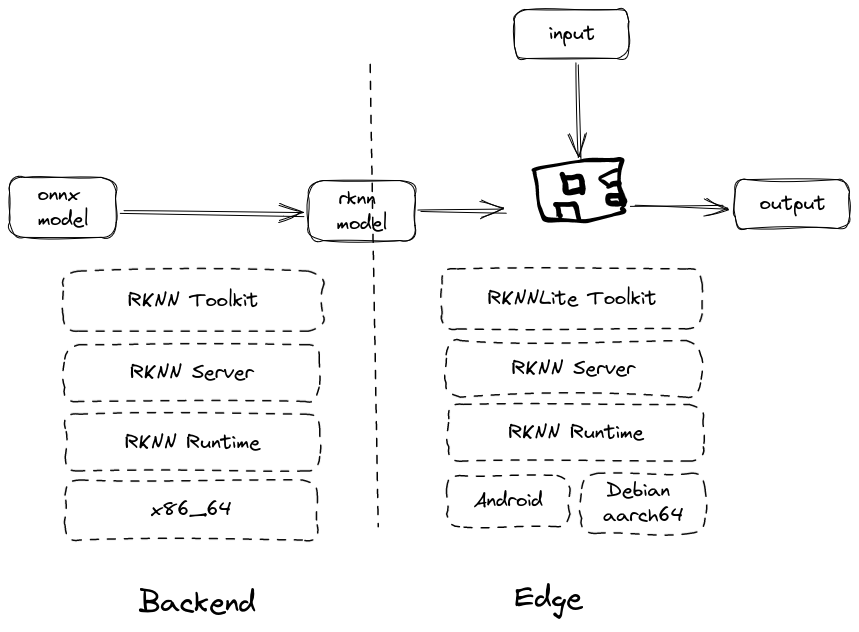

# Advocate

Hyper-excitement for AI, as if it time traveled from the future, is often contrasted with how limited it can bring the coolest demos into daily life. There is a stark difference in what deep models requires and what we as end users can provide. Largest language models and image diffusion models run on racks of expensive high-end NVIDIA GPU cards. Hundreds of them, thousands of them. Compared to those massive clusters, running LLM inference on end-users PCs is a cute joke, though seriously there are hacks and serious attempts to overcome compute limitation, often by model quantization and distillation, as a result, degrade the original performance as well. On smartphones the situation is not getting any better, given not powerful chipsets and constraints on battery and connectivity. This is not merely a technical obstacle. For AI to be widely accessible on the way becoming a commodity, the economic equation must be solved. Running inference costs money. Cloud-based clusters aren't free or cheap. In other word, world domination by AI eventually boils down to the producer-consumer problem of the free market: there must be strong incentives for AI to be used, for example to improve productivity, or security, or welfare, so that the benefit it brings is greater than the cost paid to run it.

This is no surprise of that the projected trend of AI growth bets heavily on the market of AI for inference but not so much for model training. It is not that learning is saturated but less needed *everywhere* but concentrated to fewer places and times, fundamentally due to the strategic move from small models to massive ones -- called *foundation models*, with hundreds of billions parameters. The cost to train such models are millions of dollars. And while cloud-based inference will be made cheaper with more competitions from different accelerated hardware vendors, zero-shot learning and foundation models are the go-to solution for could-based inference. In the long run however for end-user applications that generates steady data streams, cloud-based inference is a burden to profit margin. 

The solution is, to pay an upfront cost in order to have AI inference running on edge (a.k.a end-user) devices. This could be a worthy investment. There are certain challenges that factor edge deployment potentials: overhead cost, speed, accuracy compromise, compatibility, fleet management and maintenance. Edge inference nevertheless is vital in a lot of applications and therefore there starts to have hardware solutions in the past years. For the majority of cases, edge inference moves away from expensive GPU architectures such as of NVIDIA. It is powerful but expensive for one hand and power hungry on the other hand. But that does not mean NVIDIA is a weak player in this market. They have been working hard to deliver budget products for the edge market with the flagship Jetson family of edge chips. Manufacturers other than NVIDIA including Qualcomm, Intel, ARM focus con less power-consumming chips. For the moment this sector has been behind NVIDIA's lead but I believe in the years to come there will be a few winners standing out.

The flagship edge inference that comes from NVIDIA is Jetson family featuring TX and TX2 for several years and show shifting their focus to the new architecture Orin. Jetson Orin Nano is their next bet in the second half of 2020s. From Google there is Coral featuring a variety of ML accelerated devices in different form factors. Basically it is similar to Raspberry Pi but with accelerated hardware for deep learning; it is similar to Jetson's in this regard but uses Google's TPU (Tensor Processing Unit) instead of GPU (Graphics Processing Unit). It is claimed that TPU gives faster inference speed however its unique architecture is also its limitation. Jetson cards on the contrary can be used to run different models trained from different platforms such as Tensorflow and Pytorch as long as the CUDA library is used. That is to say, Coral boards are specifically designed to run Tensorflow Lite models and no other platforms at least in the foreseable future.

# Middle-saleman

With the flourishing of many deep learning libraries to train and run neural network models, including Tensorflow, Pytorch, Mxnet, it is difficult to unify the way operators are defined and run. On the other hand, industrial standardisation of model serialization is required for seamless deployment to different inference devices. It is worth to remind ourselves that by the end of the day neural networks are no magical than a huge graph of computation nodes and edges between them defines how inputs and outputs are connected. Under this light it is possible to iron out the starky differences between training and inference steps, as well as mathematics operations supported by different hardware. ONNX a.k.a Open Neural Network Exchange comes to this world for that only reason. The stadardisation, supported by many big corps including Microsoft, should be a prefered way to exchange models and weights trained by different tools. Hardware vendors also rely on ONNX's definition of supported operations, called Opset, to speak a common language. The real world nevertheless is never close to an utopia which leads to the fact that currently there are many standards coexists. 

At its heart, ONNX defines standards and by no mean specific implementation on particular hardware. Hardware vendors themselves with their proprietary acceleration libraries convert ONNX operations into machine-understood instructions. ONNX models can run on almost any NVIDIA GPU cards including its edge versions Jetson TX's and Orin. When coming down to more budget accelerated edge devices, ONNX data structures are converted to vendor-specific runtime formats to conform their silicon architectures. In the remainder of this post, my focus is Rockchip's Neural Processing Unit (RKNPU), etched on the SoC Radxa's Rockchip 5B, offering accelerated compute with ARM Cortex processors and Mali GPU. It is said that Rockchip 5B runs 3x faster than Raspberry Pi. 

